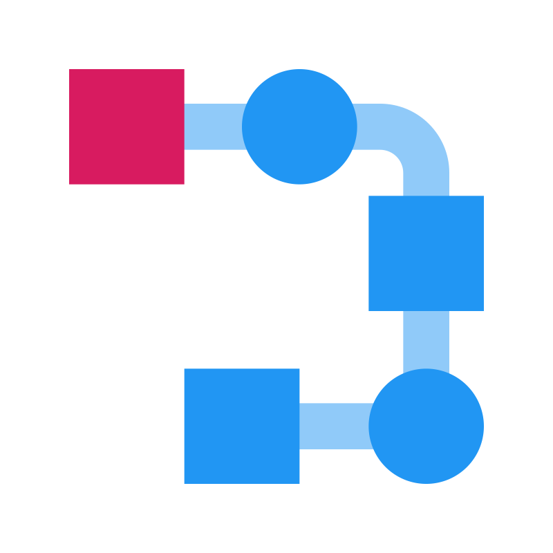

  

# Flush

#### Compiler and interpreter for a custom programming language.

### Usage

- `flush build <file>`
- `flush run <file>`

### Project status

In progress, early development.

### Technologies Used

- [C# 12 (.NET Core 8)](https://dotnet.microsoft.com/en-us/languages/csharp) - The programming language of the project
- [ANTLR4](https://github.com/antlr/antlr4) - Grammar rules, compiler source generation
- [System.CommandLine](https://github.com/dotnet/command-line-api) - Command line argument parsing
