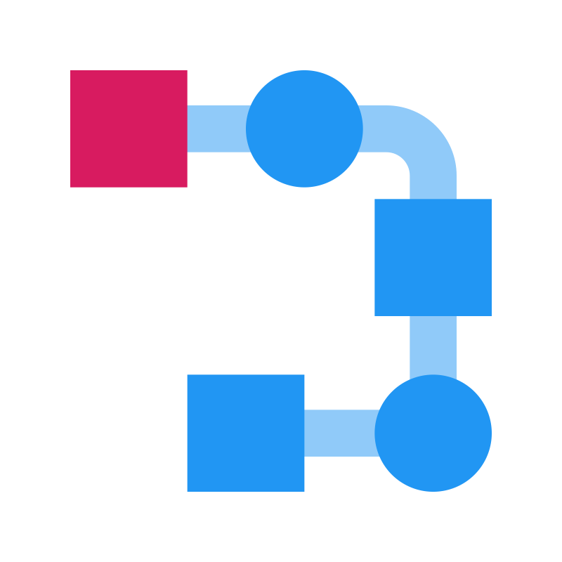

  

# Flush

#### Compiler and interpreter for a custom programming language. 

### Project status

In progress, early development.

### Technologies Used

- <a href="https://dotnet.microsoft.com/en-us/languages/csharp">C# 12 (.NET Core 8)</a> - The programming language of the project
- <a href="https://github.com/antlr/antlr4">ANTLR4</a> - Grammar rules, compiler source generation
